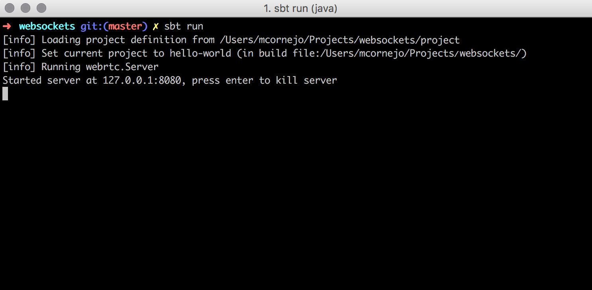
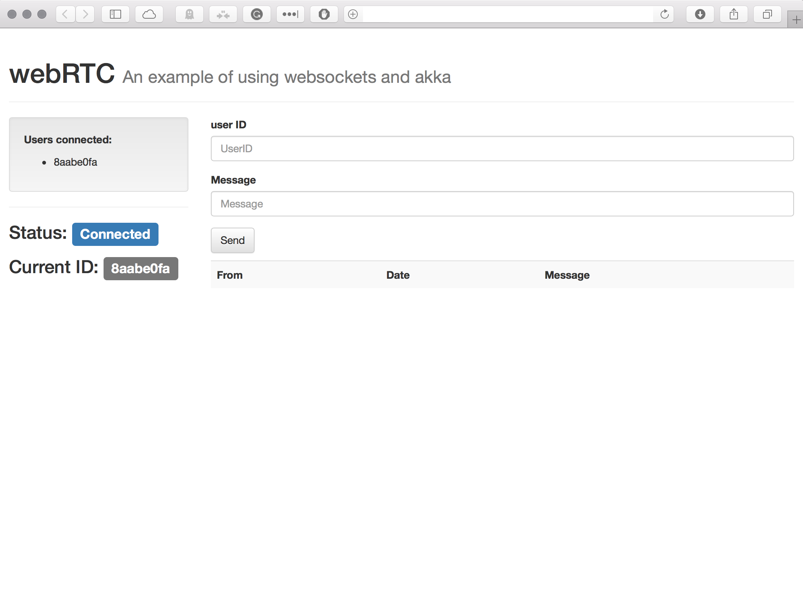
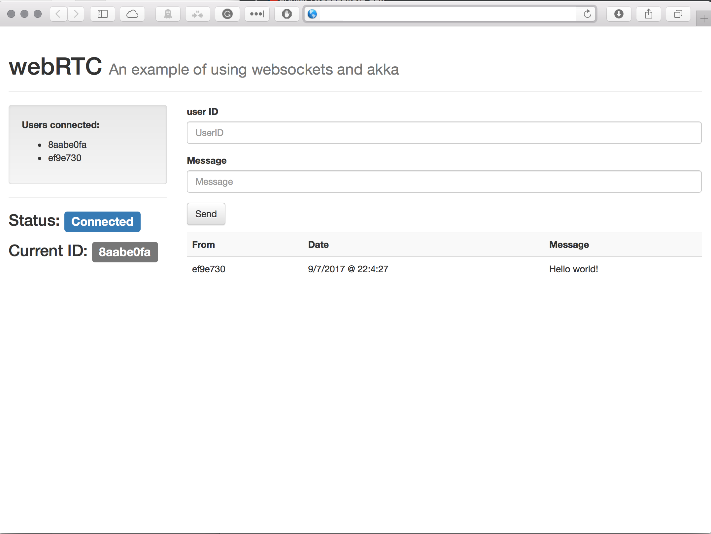
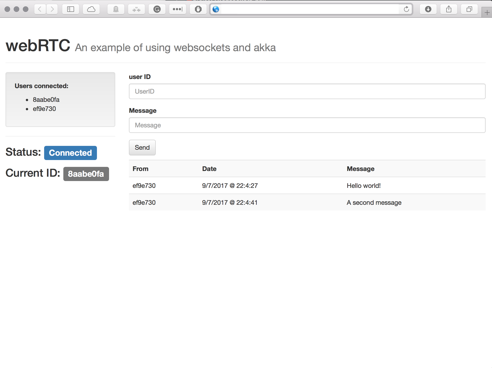

# webRTC

The idea of this project is to show the application of websockets as 
signalisation protocol for webRTC. In here we present a basic websocket
management using akka-http as backend and javascript as frontend in the browser.
  
## Internals
The protocol is managed by three entities: The websocket manager, the 
signalisation protocol that routes messages and the user actor that sends
and receives messages.

When a client requests a websocket to the backend, an actor is created to
handle that connection, and the reference to the actor is stored in a Map 
such as (Actor ID -> ActorReference). This actor receives messages from the
signalisation protocol and forwards them to the frontend client.

After the first connection, the server creates the User actor and returns to the user
its `User ID`. This ID value is shown in the screen as reference. To send a message
to another user in the system, the client must provide the `User ID` of the receiver
along with the message.

If the user is still connected, the backend will deliver the message to the client.

# API 

## Reference

This webRTC demo provides one endpoint:

`ws://localhost:8080/get` that can be called using the JSON library in 
most of modern Javascript engines present in current browsers:

## Usage
To run the server, just open the terminal and run (sbt is required to compile):

```bash
$ cd webRTC
$ sbt run
```

To try the frontend, just open the index.html like it is shown next:







## Test
akka (www.akka.io) was designed as highly distributed and performant platform. With this in mind,
The code was tested in development mode with the following results:


```
Thor: https://github.com/observing/thor
(thor --amount 5000 ws://localhost:8080/get)

Online               20548 milliseconds
Time taken           20548 milliseconds
Connected            5000
Disconnected         0
Failed               0
Total transferred    6.02MB
Total received       957.03kB
```

## Documentation
Classes and code contain its own comments explaining how they work.
